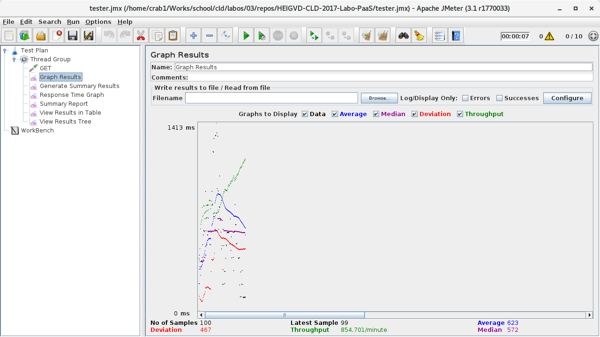
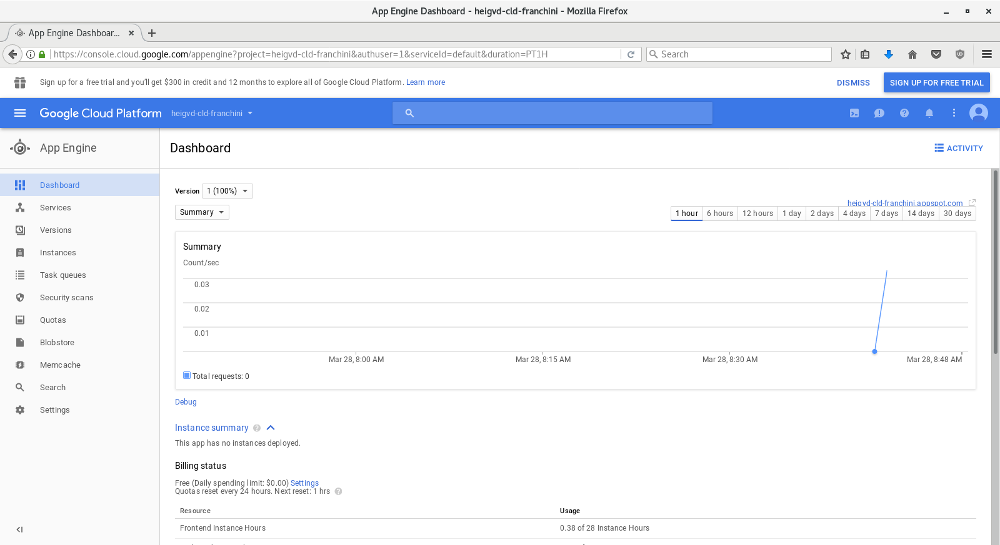
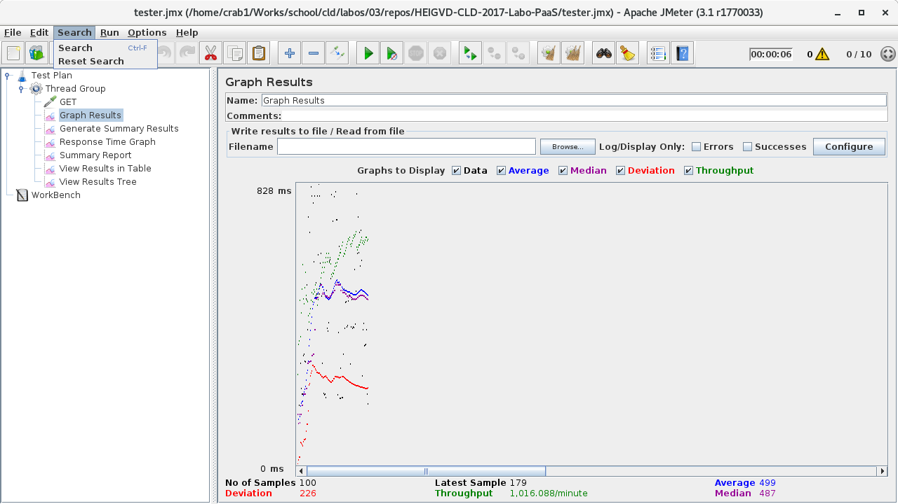
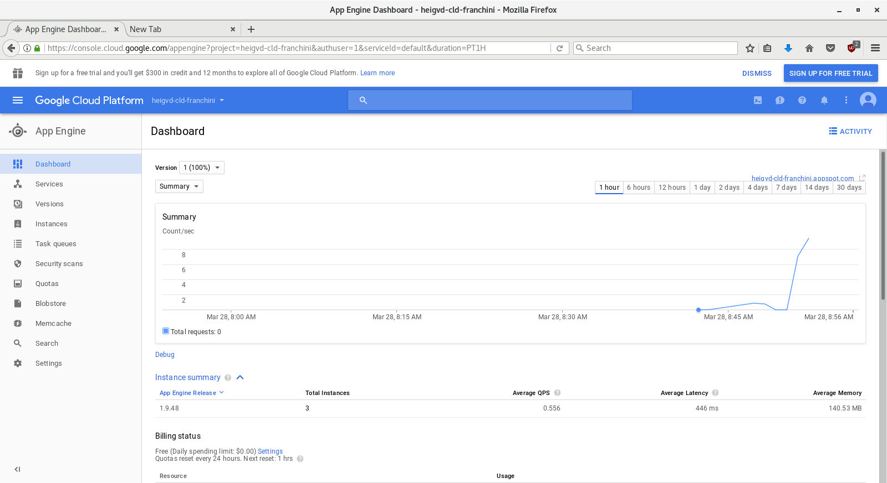
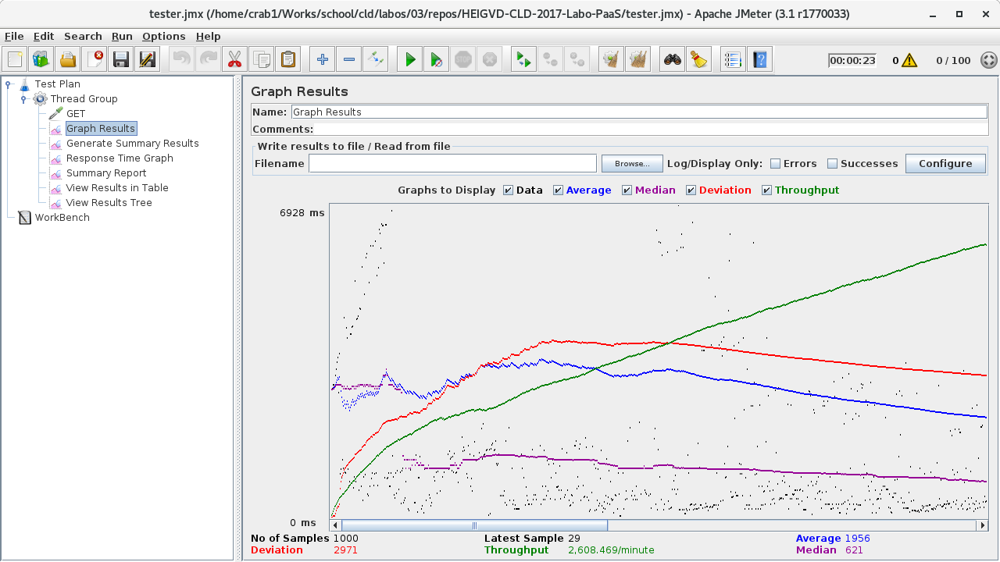
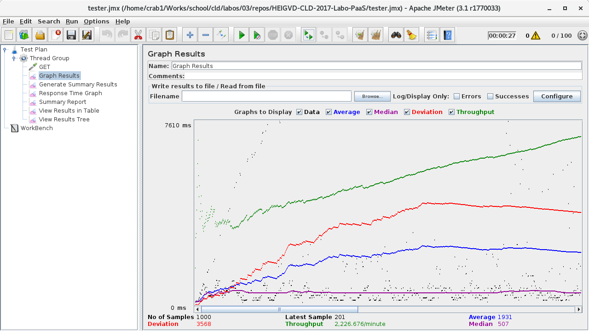
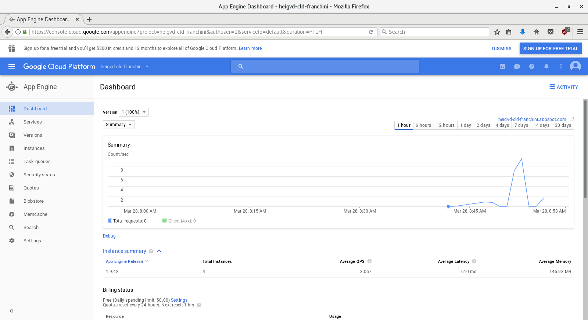
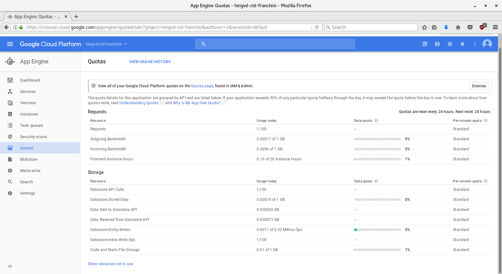

# LABORATOIRE 3 - GOOGLE APP ENGINE

Dans les prédédents laboratoire, nous nous sommes initiés aux infrastructures
cloud de type Infrastructure as a Service (IaaS). Nous avions dû déployer une
application web en utilisant les services web d'Amazon (AWS). Pour ce
laboratoire, nous nous intéressons aux infrastructures cloud de type Platform
as a Service (PaaS) et plus particulièrement au service Google App Engine (GAE).
Nous allons, premièrement, déployer une application web simple. Ensuite, nous
allons écrire notre propre application web, utilisant des service GAE. Pour
terminer, nous testerons sa performance.

## ÉTUDIANTS

* FRANCHINI Fabien
* DONGMO NGOUMNAÏ Annie Sandra

## TABLE DES MATIÈRES

1. [Tâche 1: Déployment d'une application web simple](#t%C3%82che-1-deployment-dune-application-web-simple)
2. [Tâche 2: Développement d'un servlet utilisant le datastore](#t%C3%82che-2-developpement-dun-servet-utilisant-le-datastore)
3. [Tâche 3: Test de performance des écritures dans le datastore](#t%C3%82che-3-test-de-performance-des-%C3%89critures-dans-le-datastore)
4. [Conclusion](#conclusion)

## TÂCHE 1: DEPLOYMENT D'UNE APPLICATION WEB SIMPLE

Dans ce chapitre, nous allons déployer une application simpliste pour découvrir
le service GAE. Premièrement, nous allons initialiser un nouveau projet dans
l'IDE Eclipse. Ensuite, nous allons le déployer sur GAE.

Pour la suite, nous assumons qu'un compte GMail et GAE a été créé. De plus,
utilisons la machine virtuelle pré-configurée pour ce laboratoire. Pour de plus
amples informations, se référer au
[tutoriel de mise en route](https://cyberlearn.hes-so.ch/mod/page/view.php?id=665111).

À l'ouverture d'Eclipse, nous sommes accueillis sur une fenêtre vide. L'ajout
du plugin GAE, permet de voir l'apparition d'un bouton dans la barre de menu.

Pour créer un nouveau projet adapté à cette infrastructure, il faut générer un
workspace, à partir du menu déroulant, découlant de ce bouton et se rendre sur
"New Web Application Project...".


Pour les besoins de ce premier projet, nous spécifions un nom de package,
parlant (ch.heigvd.cld.lab). Comme le projet est simpliste, nous désactivons
l'utilisation de GWT. Pour terminer, à titre pédagogique, nous souhaitons
générer du code d'exemple.


À présent, nous devons appliquer diverses configuration. GAE permet uniquement
de faire tourner du Java 7. Or par défaut, Eclipse prend en charge du code Java
8.

Pour ce faire, nous devons nous rendre dans les propriétés de l'espace de
travail comme dans la capture suivante, ou en entrant la combinaison
"Alt+Enter".


Premièrement, nous spécifions le compilateur par défaut.


Ensuite, nous devons nous rendre dans le menu "Project Facets" et spécifier la
bonne version de Java.


Comme nous avons changer drastiquement la configuration, il est nécessaire de
reconstruire le projet.


L'espace de travail est correctement configuré.


À présent, nous étudions les fichiers d'examples générés. Nous avons dans
`Lab03/src/ch.heigvd.cld.lab/`, un premier Servlet nommé `Lab03Servlet.java`.
Pour rappel, un Servlet est un objet qui va permettre à l'application de traiter
les requêtes des clients. Dans notre cas, Servlet affiche un simple
"Hello, world" en retour d'une requêt HTTP GET.

Pour plus d'information: [Lien](https://github.com/SoftEng-HEIGVD/Teaching-HEIGVD-AMT-Lectures/blob/master/bootcamp-02/bootcamp-02.pdf)

```java
package ch.heigvd.cld.lab;

import java.io.IOException;

@SuppressWarnings("serial")
public class Lab03Servlet extends HttpServlet {
    public void doGet(HttpServletRequest req, HttpServletResponse resp) throws IOException {
    resp.setContentType("text/plain");
    resp.getWriter().println("Hello, world");
    }
}
```

Contrairement à une approche plus simple, nous n'ajoutons pas l'annotation
@WebServlet("lab03"). Cette annotation indique que le Servlet est instancié
lorsqu'un client se rend sur le chemin `/lab03` (mapping).

Nous utilisons un fichier xml qui se chargera de ce travail. Il se situe dans
`Lab03/war/WEB-INF/lib/` et est nommé `web.xml`. Le mapping des requêtes au
Servlet correspondant est effectué à cet endroit. Nous devons déclarer le nom
du Servlet, à quel classe il est représenté, et a quel path il doit être
instancié.

```xml
<?xml version="1.0" encoding="utf-8"?>
<web-app xmlns:xsi="http://www.w3.org/2001/XMLSchema-instance"
xmlns="http://java.sun.com/xml/ns/javaee"
xmlns:web="http://java.sun.com/xml/ns/javaee/web-app_2_5.xsd"
xsi:schemaLocation="http://java.sun.com/xml/ns/javaee
http://java.sun.com/xml/ns/javaee/web-app_2_5.xsd" version="2.5">
	<servlet>
		<servlet-name>Lab03</servlet-name>
		<servlet-class>ch.heigvd.cld.lab.Lab03Servlet</servlet-class>
	</servlet>
	<servlet-mapping>
		<servlet-name>Lab03</servlet-name>
		<url-pattern>/lab03</url-pattern>
	</servlet-mapping>
	<welcome-file-list>
		<welcome-file>index.html</welcome-file>
	</welcome-file-list>
</web-app>
```

Nous avons un troisième fichier, situé dans `Lab03/war/WEB-INF/lib/` et nommé
`appengine.xml` qui est intéressant. Il sert à définir la configuration de
l'application dans GAE.

```xml
<?xml version="1.0" encoding="utf-8"?>
<appengine-web-app xmlns="http://appengine.google.com/ns/1.0">
  <application></application>
  <version>1</version>

  <!--
    Allows App Engine to send multiple requests to one instance in parallel:
  -->
  <threadsafe>true</threadsafe>

  <!-- Configure java.util.logging -->
  <system-properties>
    <property name="java.util.logging.config.file" value="WEB-INF/logging.properties"/>
  </system-properties>

  <!--
    HTTP Sessions are disabled by default. To enable HTTP sessions specify:

      <sessions-enabled>true</sessions-enabled>

    It's possible to reduce request latency by configuring your application to
    asynchronously write HTTP session data to the datastore:

      <async-session-persistence enabled="true" />

    With this feature enabled, there is a very small chance your app will see
    stale session data. For details, see
    https://cloud.google.com/appengine/docs/java/config/appconfig#Java_appengine_web_xml_Enabling_sessions
  -->

</appengine-web-app>
```

Après avoir étudier le code source généré, nous tentons de faire tourner
l'application localement.

Pour ce faire, nous devons choisir l'option "Run As" -> "Web Application".


En inspectant la console, nous nous rendons compte qu'un serveur local a bien
été déployé.


Nous nous rendons, avec un naviguateur, à l'adresse `http://localhost:8888/`.
Nous remarquons une liste de tout les Servlet actifs.


Pour terminer, nous souhaitons arrêter le serveur d'application. Pour ce faire,
dans la console, il faut cliquer sur la carré rouge permettant son arrêt.


Nous avons testé le bon fonctionnement de l'application, localement. À présent
nous voulons la déployer sur GAE. Premièrement, il faut se rendre dans la
console d'administration de GAE, pour initialiser le projet.

**Note:** Le service GAE est en constante évolution. Les procédures décrites
après peuvent différer au fil du temps.


Nous lui définissons un identifiant. ##########


Maintenant, nous sommes invités à spécifier le langage utilisé pour
l'application et la position géographique des instances où elle sera déployée.


À présent, nous pouvons retourner dans `eclipse`, pour terminer le déployment
de l'application.


Dans les paramètres du projet, nous devons spéficier l'identifiant précédement
défini dans GAE.


## TÂCHE 2: DEVELOPPEMENT D'UN SERVET UTILISANT LE DATASTORE

Dans ce chapitre, nous allons nous initier à l'utilisation du Datastore de GAE.
Pour ce faire, nous allons créer un Servlet qui se chargera d'écrire dans le
Datastore, tous les paramètres de l'URL associés.

Premièrement nous créons un nouveau Servlet dans le package `ch.heigvd.cld.lab`,
nommé `DatastoreWriteServlet.java`.

```java
package ch.heigvd.cld.lab;

import java.io.IOException;
import java.io.PrintWriter;
import java.util.Enumeration;

import javax.servlet.http.*;

import com.google.appengine.api.datastore.DatastoreService;
import com.google.appengine.api.datastore.DatastoreServiceFactory;
import com.google.appengine.api.datastore.Entity;

@SuppressWarnings("serial")
public class DatastoreWriteServlet extends HttpServlet {
	public void doGet(HttpServletRequest req, HttpServletResponse resp) throws IOException {
		String kind;
		String key;

		resp.setContentType("text/plain");
		PrintWriter pw = resp.getWriter();

		kind = req.getParameter("_kind");

    // https://cloud.google.com/appengine/docs/standard/java/datastore/entities
		if (kind == null || kind.startsWith("__")) {
			pw.println("_kind paramater is missing or begin with two underscore (reserved).");
		}
		else {
			Entity e;
			Enumeration<String> parameterNames;
			String parameterName;
			String parameterValue;

			DatastoreService ds = DatastoreServiceFactory.getDatastoreService();

			key = req.getParameter("_key");

			if (req.getParameter("_key") == null) {
				e = new Entity(kind);
			}
			else {
				e = new Entity(kind, key);
			}

			parameterNames = req.getParameterNames();
			while (parameterNames.hasMoreElements()) {
				parameterName = parameterNames.nextElement();

				if (parameterName.equals("_kind") || parameterName.equals("_key")) {
					continue;
				}
				else {
					parameterValue = req.getParameter(parameterName);
					e.setProperty(parameterName, parameterValue);
				}
			}

			pw.println("Writing entity to datastore.");
			ds.put(e);
		}
	}
}
```

**Note:** La valeur du type de l'entité ne peut pas début par `__`. Tous les
types commençant par ce préfixe sont réservés par Google.

Ensuite nous devons mapper le Servlet (voir Tâche n°1). Nous suivons l'exemple
et rajoutons le nôtre. Comme nous devons impérativement spécifier des
paramètres, nous ne rajoutons pas l'entrée sur la page d'accueil.

```xml
<?xml version="1.0" encoding="utf-8"?>
<web-app xmlns:xsi="http://www.w3.org/2001/XMLSchema-instance"
xmlns="http://java.sun.com/xml/ns/javaee"
xmlns:web="http://java.sun.com/xml/ns/javaee/web-app_2_5.xsd"
xsi:schemaLocation="http://java.sun.com/xml/ns/javaee
http://java.sun.com/xml/ns/javaee/web-app_2_5.xsd" version="2.5">
	<servlet>
		<servlet-name>Lab03</servlet-name>
		<servlet-class>ch.heigvd.cld.lab.Lab03Servlet</servlet-class>
	</servlet>
	<servlet-mapping>
		<servlet-name>Lab03</servlet-name>
		<url-pattern>/lab03</url-pattern>
	</servlet-mapping>
	<servlet>
		<servlet-name>DatastoreWrite</servlet-name>
		<servlet-class>ch.heigvd.cld.lab.DatastoreWriteServlet</servlet-class>
	</servlet>
	<servlet-mapping>
		<servlet-name>DatastoreWrite</servlet-name>
		<url-pattern>/datastorewrite</url-pattern>
	</servlet-mapping>
	<welcome-file-list>
		<welcome-file>index.html</welcome-file>
	</welcome-file-list>
</web-app>
```

Nous testons à présent le Servlet en local.

[Application test step-by-step](assets/images/02-local_00.png)

[Application test step-by-step](assets/images/02-local_00b.png)

[Application test step-by-step](assets/images/02-local_01.png)

[Application test step-by-step](assets/images/02-local_02.png)

Pour la dernière requête, nous obtenons un nombre d'opération d'écriture
étrange, 6. Alors que nous avons spécifier que 4 paramètres. En interne,
GAE nécessite 2 opérations pour les champs de la clef ("\_kind", "\_key"), et 1
opération pour chaque "Property" (title, author).

Pour ce rendre dans la console du Datastore sur GAE, il faut se rendre à l'URL
suivante: `https://console.cloud.google.com/datastore/entities/query`

**Note:** Il n'y a pas de lien direct dans le dashboard pour s'y rendre. Du coup
pour trouver cet endroit il faut spécifier "Datastore" dans la barre de
recherche.

[Online datastore](assets/images/02-online_datastore.png)

## TÂCHE 3: TEST DE PERFORMANCE DES ÉCRITURES DANS LE DATASTORE

Dans ce chapitre, nous allons tester la performance de notre application. Nous
voulons comparer la vitesse de traitement d'une requête simple et d'une requête
aboutissant à des écritures dans le Datastore.

Premièrement, nous allons simuler 10 utilisateurs effectuant 10 requêtes sur
nos Servlets:

**Note:** Dans JMeter, le temps de réponse moyen est représenté par la courbe
bleue.

Pour la version sans écriture dans le Datastore:





* Temps de réponse moyen (JMeter): 623ms
* Temps de réponse moyen (GAE): n/a

Pour la version avec écriture dans le Datastore:





* Temps de réponse moyen (JMeter): 499ms
* Temps de réponse moyen (GAE): 446ms

Maintenant, nous allons simuler 100 utilisateurs effectuant 10 requêtes sur
nos Servlets:

Pour la version sans écriture dans le Datastore:




* Temps de réponse moyen (JMeter): 1956ms
* Temps de réponse moyen (GAE): 248ms

Pour la version avec écriture dans le Datastore:





* Temps de réponse moyen (JMeter): 1931ms
* Temps de réponse moyen (GAE): 610ms

Nous obtenons des temps de réponse relativement différent entre JMeter et le
dashboard GAE. Ceci est dû à la période de calcul de ces moyennes. Dans le
deuxième test, nous avons des temps de réponse moyen similaire, ceci est du au
fait que très peu de tests on été effectués auparavent. Dans les derniers tests
GAE prend en compte le temps de réponse moyen des précédentes simulation pour
le calculé. De ce fait ces résultats ne sont pas fiables.

Nous devrions imaginer une nouvelle stratégie de test plan pour relevé des
résultats plus pertinents.

Nous souhaitons maintenant vérifier les notre utilisation des services de GAE.
Pour ce faire nous nous rendons sur la page des "Quotas".



Plusieurs ressources sont utilisés.

* Requests
  * Requests: Nombre de requêtes envoyés à l'application;
  * Outgoing Bandwidth: Traffic sortant de l'application (réponses);
  * Incoming Bandwidth: Traffic entrant de l'application (requêtes);
  * Frontend Instance Hours: Temps (en heure) d'activité du frontend;
* Storage
  * Datastore API Calls: Nombre d'appels sur l'API du Datastore;
  * Datastore Stored Data: Quantité de donnée enregistré dans le Datastore;
  * Data Sent to Datastore API: Nombre de données envoyées sur l'API du Datastore;
  * Data Received from Datastore API: Nombre de données reçues depuis l'API du Datastore;
  * Datastore Entity write: Nombre d'entitée écrites dans le Datastore;
  * Datastore Index Write Ops: Nombre d'opérations d'écriture dans le Datastore;
  * Code and Static File Storage: Volume de fichier (de l'application) stocké dans GAE;
* Deployments (non dispo dans le screenshot)
  * Deployments: Nombre de déployements effectués.

À présent, nous imaginons que nous soupsounons que le scaling par GAE ne
fonctionne pas correctement. Plusieurs raisons sont possibles.

1\. Nous atteignons la limite des instances disponibles

* Nous nous rendons sur le dashboard et regardons "Instance details".

2\. Nous atteignons la limite de notre quota journalier

* Nous nous rendons sur la page des quotas pour vérifier si ils sont atteint.

3\. Un serveur de Google est down.

* Nous nous rendons sur l'outil de monitor du service GAE `https://status.cloud.google.com/`.
