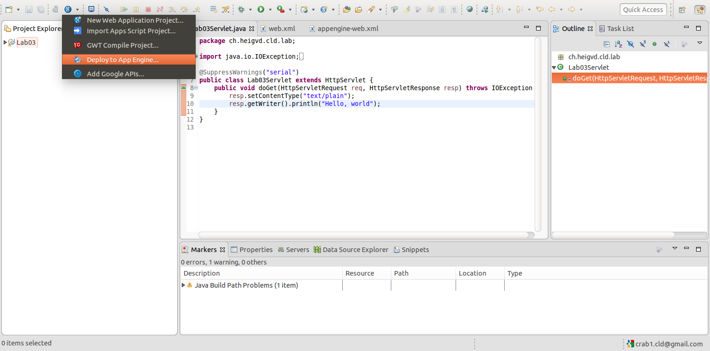

# LABORATOIRE 3 - GOOGLE APP ENGINE

Dans les prédédents laboratoire, nous nous sommes initiés aux infrastructures
cloud de type Infrastructure as a Service (IaaS). Nous avions dû déployer une
application web en utilisant les services web d'Amazon (AWS). Pour ce
laboratoire, nous nous intéressons aux infrastructures cloud de type Platform
as a Service (PaaS) et plus particulièrement au service Google App Engine (GAE).
Nous allons, premièrement, déployer une application web simple. Ensuite, nous
allons écrire notre propre application web, utilisant des service GAE. Pour
terminer, nous testerons sa performance.

## ÉTUDIANTS

* FRANCHINI Fabien
* DONGMO NGOUMNAÏ Annie Sandra

## TABLE DES MATIÈRES

1. [Tâche 1: Déployment d'une application web simple](#t%C3%82che-1-deployment-dune-application-web-simple)
2. [Tâche 2: Développement d'un servlet utilisant le datastore](#t%C3%82che-2-developpement-dun-servet-utilisant-le-datastore)
3. [Tâche 3: Test de performance des écritures dans le datastore](#t%C3%82che-3-test-de-performance-des-%C3%89critures-dans-le-datastore)
4. [Conclusion](#conclusion)

## TÂCHE 1: DEPLOYMENT D'UNE APPLICATION WEB SIMPLE

Dans ce chapitre, nous allons déployer une application simpliste pour découvrir
le service GAE. Premièrement, nous allons initialiser un nouveau projet dans
l'IDE Eclipse. Ensuite, nous allons le déployer sur GAE.

Pour la suite, nous assumons qu'un compte GMail et GAE a été créé. De plus,
utilisons la machine virtuelle pré-configurée pour ce laboratoire. Pour de plus
amples informations, se référer au
[tutoriel de mise en route](https://cyberlearn.hes-so.ch/mod/page/view.php?id=665111).


A la suite de cette création nous avons une serie de fichiers et package généré automatiquement nous allons nous intéressé plus particulièrementau fichier Lab03Servelet.java, web.xml et appengine-web.xml.
Le code suivant est généré automatiquement dans le fichier Lab03Servelet on remarque qu'il s'agit là d'un servelet ayant pour but de répondre aux requêtes HTTP. Ainsi d'après ce code il devrait (le servelet) répondre à la requête HTTP de type GET au travers de la methode doGet en envoyant un message "hello world" en clair.

```java
package ch.heigvd.cld.lab;

import java.io.IOException;

@SuppressWarnings("serial")
public class Lab03Servlet extends HttpServlet {
    public void doGet(HttpServletRequest req, HttpServletResponse resp) throws IOException {
    resp.setContentType("text/plain");
    resp.getWriter().println("Hello, world");
    }
}
```

Le code suivant est celui du fichier web.xml. En effet, il s'agit d'un fichier de configuration classique de notre Java EE ou plus exactement d'un fichier descripteur de deploiement. Ainsi, il décrit les classes et les configurations de notre application web on voit par exemple là que notre servelet Lab03 est appelé lorsque le visiteeur essaie d'accéder à la page /lab03 de notre site. On peut deduire de cela que ce fichier permet d'effectuer un mapping entre l'URL de la requête et un code worker.

```xml
<?xml version="1.0" encoding="utf-8"?>
<web-app xmlns:xsi="http://www.w3.org/2001/XMLSchema-instance"
xmlns="http://java.sun.com/xml/ns/javaee"
xmlns:web="http://java.sun.com/xml/ns/javaee/web-app_2_5.xsd"
xsi:schemaLocation="http://java.sun.com/xml/ns/javaee
http://java.sun.com/xml/ns/javaee/web-app_2_5.xsd" version="2.5">
	<servlet>
		<servlet-name>Lab03</servlet-name>
		<servlet-class>ch.heigvd.cld.lab.Lab03Servlet</servlet-class>
	</servlet>
	<servlet-mapping>
		<servlet-name>Lab03</servlet-name>
		<url-pattern>/lab03</url-pattern>
	</servlet-mapping>
	<welcome-file-list>
		<welcome-file>index.html</welcome-file>
	</welcome-file-list>
</web-app>
```
Le code suivant est celui du fichier appengine-web.xml. Il s'agit là d'un fichier de configuration propre à google appengine, il permet de donner des informations sur notre application app Engine (nom, version et autre), d'activer certaine fonctionnalités comme les sessions, services googles et permet également à l'application de traiter ou pas les requêtes concurrentes par la balise ``threadsafe`` 

```xml
<?xml version="1.0" encoding="utf-8"?>
<appengine-web-app xmlns="http://appengine.google.com/ns/1.0">
  <application></application>
  <version>1</version>

  <!--
    Allows App Engine to send multiple requests to one instance in parallel:
  -->
  <threadsafe>true</threadsafe>

  <!-- Configure java.util.logging -->
  <system-properties>
    <property name="java.util.logging.config.file" value="WEB-INF/logging.properties"/>
  </system-properties>

  <!--
    HTTP Sessions are disabled by default. To enable HTTP sessions specify:

      <sessions-enabled>true</sessions-enabled>

    It's possible to reduce request latency by configuring your application to
    asynchronously write HTTP session data to the datastore:

      <async-session-persistence enabled="true" />

    With this feature enabled, there is a very small chance your app will see
    stale session data. For details, see
    https://cloud.google.com/appengine/docs/java/config/appconfig#Java_appengine_web_xml_Enabling_sessions
  -->

</appengine-web-app>
```





## TÂCHE 2: DEVELOPPEMENT D'UN SERVET UTILISANT LE DATASTORE

Dans cette partie nous allons créer un servlet qui permettra d'écrire des données dans le DATASTORE. tout d'abord nous allons tester le fonctionnement du servelet mis à disposition pour ce labo ``DataStoreWriteSimple.java`` ceci dans le but d'apprendre la syntaxe à utiliser pour enregistrer les données dans le datastore. Ensuite nous allons implementer notre servelet ``DataStoreWrite`` en suivant les spécifications données, enfin nous allons tester notre servlet en local et le deployer sur App Engine.

le code suivant represente le code de notre servelet ``DataStoreWrite``.Comme vous pouvez le constatez il est très simple, dans un premier temps on recupère la valeur du paramètre `_kind`, s'il n'existe on arrête car on ne pourrais créer une entité dont le nom n'existe pas disons que ce paramètre est obligatoire contrairement au paramètre `_key` qui peut être généré automatiquement. Si le paramètre `_kind` est défini alors on crée notre entité, on récupère la liste des noms de paramètre mis à disposition, on defini les propriétés de notre entité avec les paramètres et leur contenu enfin l'entité est sauvegardé dans la base de donnée  

```
package ch.heigvd.cld.lab;

import java.io.IOException;
import java.io.PrintWriter;
import java.util.Enumeration;

import javax.servlet.ServletException;
import javax.servlet.http.HttpServlet;
import javax.servlet.http.HttpServletRequest;
import javax.servlet.http.HttpServletResponse;

import com.google.appengine.api.datastore.DatastoreService;
import com.google.appengine.api.datastore.DatastoreServiceFactory;
import com.google.appengine.api.datastore.Entity;

@SuppressWarnings("serial")
public class DatastoreWrite extends HttpServlet{
	@Override
    protected void doGet(HttpServletRequest req, HttpServletResponse resp)
                         throws ServletException, IOException {
		
	DatastoreService datastore = DatastoreServiceFactory.getDatastoreService();
        
        String _kind = req.getParameter("_kind");
	if(_kind == null)
	  return;
        Entity myEntity = new Entity(_kind);
        Enumeration<String> params = req.getParameterNames();
      
        for(Enumeration<String> p = params;p.hasMoreElements();){
        	String s  = p.nextElement();
        	if(!s.equals("_kind")){
        		myEntity.setProperty(s, req.getParameter(s));
        	}
        	
        }
        datastore.put(myEntity);
    }

}
```
Pour tester ce servelet nous avons dû rajouter les lignes suivantes dans le fichier ``web.xml``


L'image suivante représente le test de notre servelet en local :


L'image suivante représente le test de notre application après le déploiement : 


## TÂCHE 3: TEST DE PERFORMANCE DES ÉCRITURES DANS LE DATASTORE
dans cette partie nous allons tester les performances des servlets et plus particulièrement celle du 2ème servlet. Pour cela nous allons d'abord mesurer les performances du servlet ``lab03`` ensuite ceux du servlet ``DataStoreWrite`` et enfin effectuer une comparaison entre leur temps de latence.

performances servlet ``lab03``: 
Resume


Instance


Latence


JMeter


performances servelet ``DataStoreWrite``   

Resume


Instance


Latence


JMeter


après comparaison des 2  servlets et surtout en se fiant au temps de reponse dans les différents cas on remarque le servlet ``datastorewrite``a un temps de réponse plus elevé que celui du servlet ``lab03``(voire figure ci dessous) ce qui peut s'expliquer par le fait que le servlet lab03 n'effectue qu'une simple requête ne faisant pas vraiment intervenir le dataStore il n'effectue pas d'ecriture!! contrairement à datastoreWrite qui lui écrit dans la base de donnée et nous savons tous que l'ecriture dans une base de donnée est quelque fois coûteuse.


En ce qui concerne les quotas des ressources utilisées dans ce test nous avons uniquement 2 qui sont à 1% (voire figure ci dessous)
`Heure de l'instance frontend` : durée en heure de l'exécution de l'instance qui dans notre cas est relativement petit (manipulation n'a pas durée)
`Stockage du code et des fichiers statiques` : représente la taille du code et des fichiers stockés


## CONCLUSION

Ce laboratoire nous a permis de nous familiariser avec 
